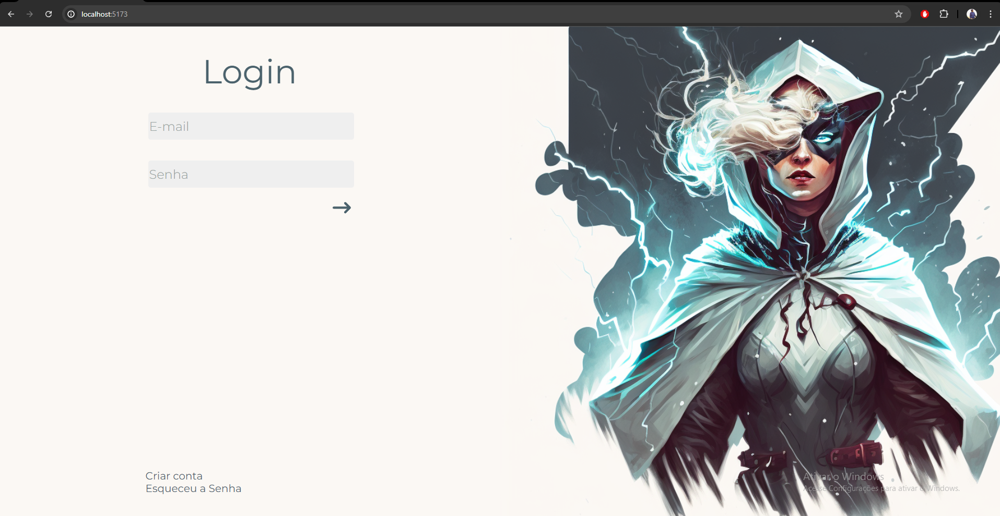
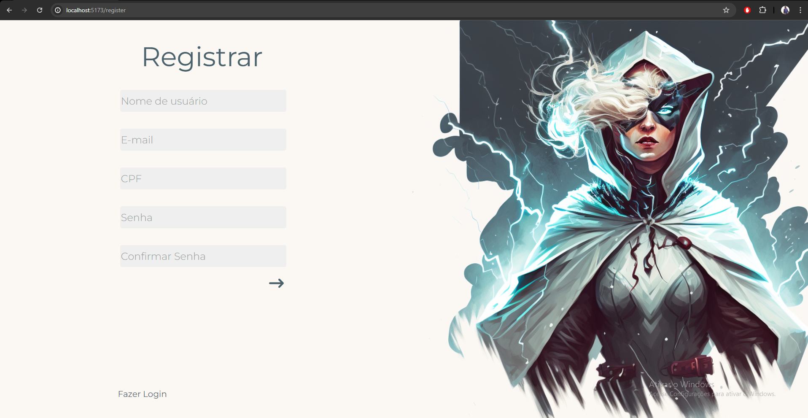
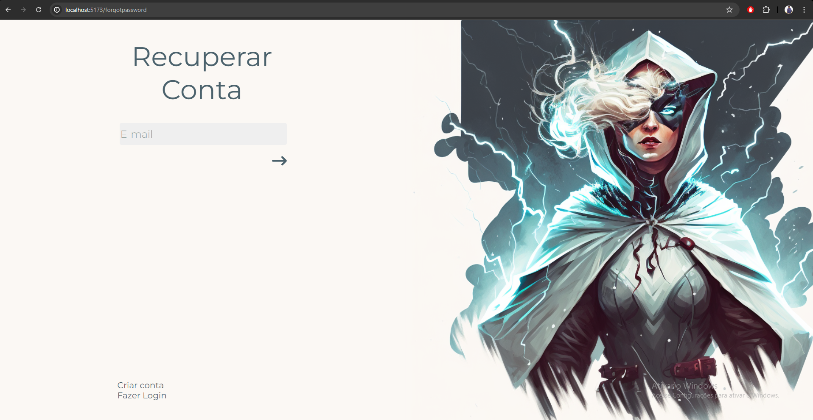
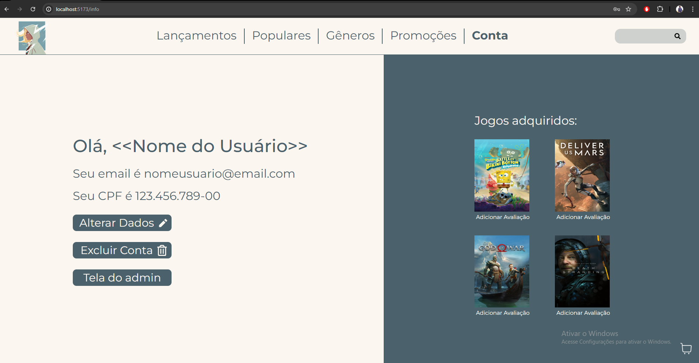
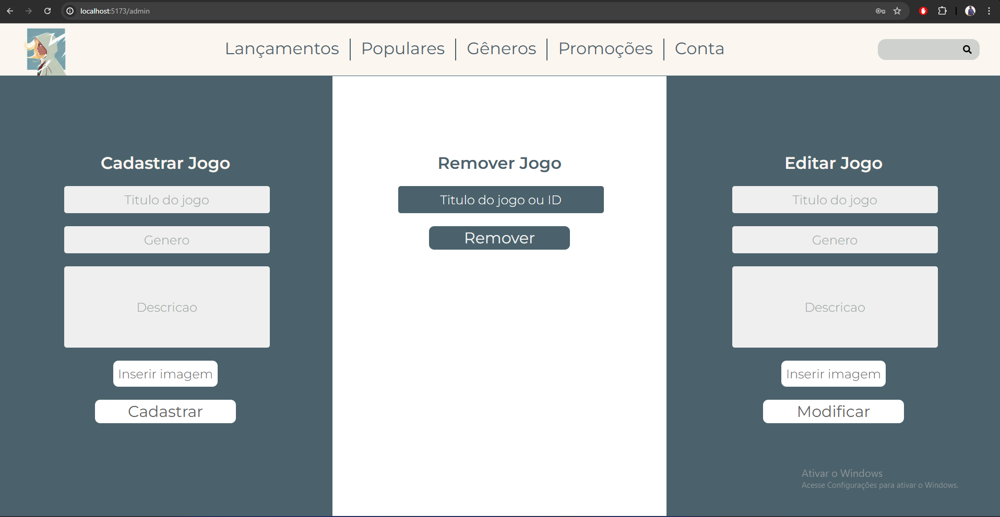
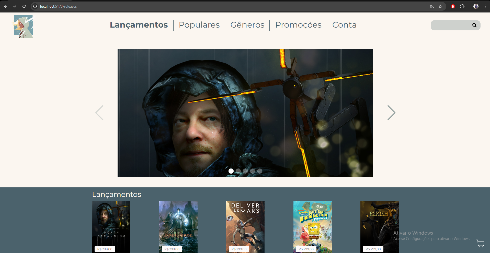
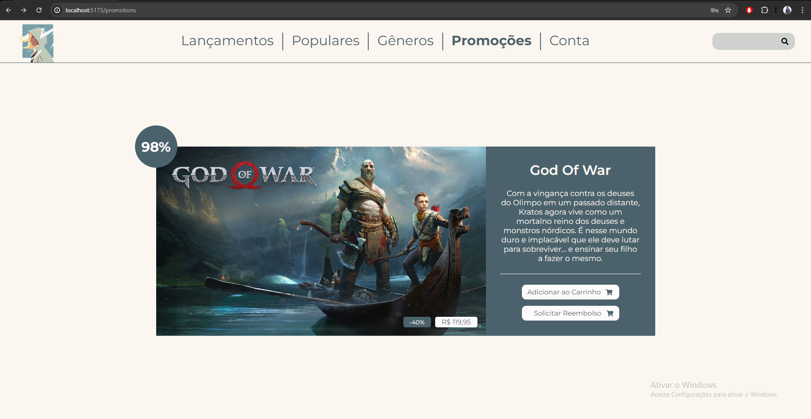
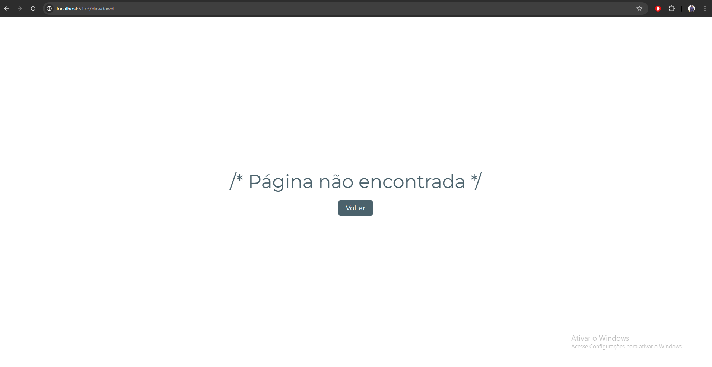

## Game Dame

## EN-US:
## Description:
This is a full-stack project for a game purchasing website called Game Dame. It features pages for registration, login, password recovery, shopping cart, releases, popular games and account information. The project is developed using React.js, Express.js, MUI, Swiper, HTML, CSS, Jotai, Styled Components and MongoDB.

## PT-BR:
## Descrição:
Este é um projeto de full-stack para um site de compras de jogos chamado Game Dame. Ele possui páginas de registro, login, recuperação de senha, carrinho de compras, lançamentos, jogos populares e informações da conta. O projeto foi desenvolvido utilizando React.js, Express.js, MUI, HTML, CSS, Jotai, Styled Components and MongoDB.

## Images:

